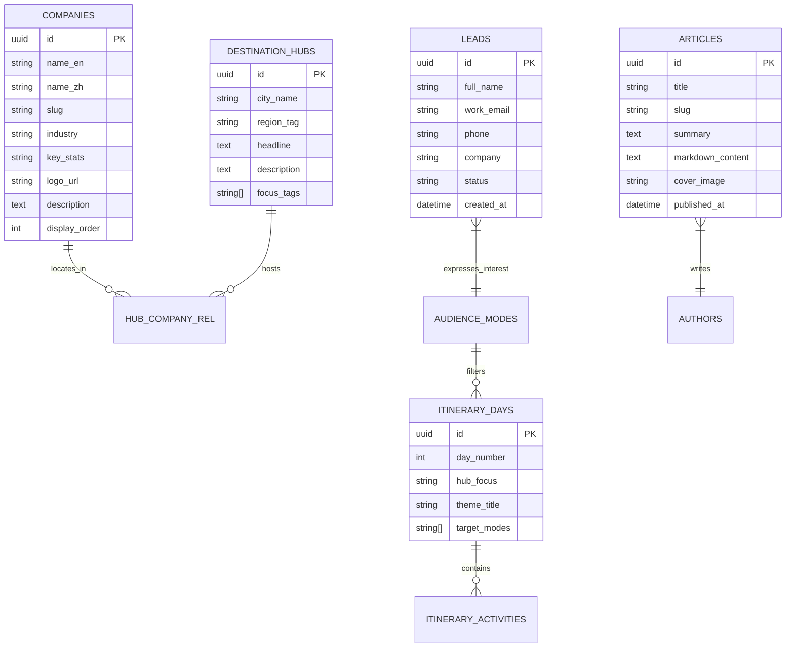

# 商业科技游学研学平台 (Frontier Tech Immersion) 系统架构设计书

## 一、 项目背景与架构设计原则

本架构书旨在为复刻并拓展类似于 `china-ai-tour.com` 的高端 B2B 科技与产业商务考察、智库游学平台提供完整的工程技术指导。
系统定位为**面向全球跨国企业高管、商学院 EMBA、投资机构与政府经贸代表团的高客单价咨询与研学转化平台**。

### 核心设计原则：
1. **合法合规与品牌独立性**：视觉排版与交互范式采用自主编写的现代瑞士网格与杂志风，内容（企业名单、行程天数、智库文章、媒体资源）全部采用全新生成的原创/公版内容，杜绝侵权风险。
2. **动静解耦的数据抽象设计 (Data Abstraction Layer)**：
   - **V1 阶段（极速交付）**：前端页面由强类型的本地静态数据源驱动，无数据库启动依赖，零部署门槛，保证 100% 静态优化（SSG）和极致的加载性能。
   - **V2 阶段（无缝切换动态后台）**：通过“数据仓库仓储模式 (Repository Pattern)”，无需改动任何 UI 组件代码，仅需切换数据提供者接口，即可直接接入 Supabase/PostgreSQL 后端与管理后台。
3. **国际化与多客群动态自适应 (Multi-Persona State Engine)**：前端状态机支持秒级切换不同客户角色（企业战略、商学院教学、政企考察），联动全页面的内容展示。

---

## 二、 完整技术栈选型与决策论证

| 层级 | 推荐选型 | 备选方案 | 选型决策论证 |
| :--- | :--- | :--- | :--- |
| **基础开发框架** | **Next.js 14/15 (App Router)** | Remix / Vite + React SPA | **必选 Next.js**。该项目面向海外高净值商业群体，强依赖 SEO 与全球极速加载。Next.js 的 React Server Components (RSC) 与增量静态再生成 (ISR) 能够兼顾静态站点的秒开体验与动态内容更新。 |
| **开发语言** | **TypeScript 5.x** | JavaScript | 全流程静态类型检查，尤其是确保复杂的行程、多语言字典、企业实体拥有严谨的契约规范。 |
| **样式与设计系统**| **Tailwind CSS + CSS Variables** | CSS Modules / Styled-Components | 完美复刻 `.taste-*` 设计 Token，编译产物极小（原站 CSS 仅 58KB），原子化类名便于响应式网格与发丝线布局。 |
| **动画引擎** | **GSAP + ScrollTrigger + @gsap/react** | Framer Motion | 原站的核心交互在于**吸顶堆叠卡片**（Sticky Stacking Cards）与精准的滚动百分比驱动（Scroll Scrubbing），GSAP 在处理这类复杂的滚动位置控制与多元素交错入场上性能最强、耗电最低。 |
| **图标库** | **Lucide React + 自定义 SVG** | FontAwesome | 现代、简洁的几何线性图标，Tree-shaking 支持极好。 |
| **第一版数据驱动**| **Local Typed TypeScript/JSON Provider** | 硬编码在组件中 | 采用领域驱动的接口抽象，将所有数据定义在 `/lib/data/`，便于未来一键切换数据库。 |
| **目标生产数据库**| **Supabase (PostgreSQL 15+)** | PlanetScale (MySQL) / MongoDB | **强烈推荐**。内置 Auth、Postgres 关系型数据库、全托管 Storage（存图片/视频）、即开即用的 Studio 管理后台，省去自建 Admin 面板的人力成本。 |
| **部署托管** | **Vercel** / Cloudflare Pages | AWS EC2 / Docker 自建 | 配合 Next.js 最佳，提供全球 CDN 边缘节点、自动 HTTPS、免运维。 |

---

## 三、 数据库选型深入对比分析

针对后续管理人员需要通过后台维护参访企业、发布研学博客、管理日程等需求，评估如下数据库方案：

```
                    ┌──────────────────────────────────────────────┐
                    │            数据库方案综合对比决策               │
                    └──────────────────────────────────────────────┘
           
     维度                Supabase (PostgreSQL)           自建 MySQL / Mongo        Headless CMS (Strapi / Payload)
   ───────────────────────────────────────────────────────────────────────────────────────────────────
   管理面板 (GUI)      开箱即用 (Supabase Studio)        需额外手写/搭 Admin后台     自带高度定制化管理界面
   多媒体存储 (OSS)     自带全托管 Storage (S3兼容)       需自行对接 阿里云/AWS S3    自带媒体库上传管理
   开发维护成本        接近 0，Serverless 托管          高，需维护运维、备份与扩容    中等，需单独维护 CMS 实例
   数据关系复杂度      原生支持外键、JSONB、事务         关系型支持良好              建模受限于 CMS 预设格式
   扩展性与定制度      标准 SQL，无任何 Vendor Lock-in   极高                       受限于框架插件生态
```

### 决策结论：
- **阶段一（当前）**：使用本地 TypeScript 静态数据模拟，0 数据库成本，快速验证产品形态与视觉交互。
- **阶段二（动态后台）**：直接接入 **Supabase PostgreSQL**。既能享受关系型数据库的强一致性，又直接附赠了可视化表格编辑器、文件上传存储桶（用于存放实景图片），是最优雅且低成本的解法。

---

## 四、 数据库模型与 E-R Schema 设计

以下是为后续接入数据库预先设计的标准 PostgreSQL 表结构定义，数据类型与字段完全向下兼容第一版的静态结构：



### 1. 参访企业表 (`companies`)
```sql
CREATE TABLE companies (
  id UUID PRIMARY KEY DEFAULT gen_random_uuid(),
  name_en VARCHAR(100) NOT NULL,          -- 英文名，如 'Unitree Robotics'
  name_zh VARCHAR(100),                   -- 中文名，如 '宇树科技'
  slug VARCHAR(100) UNIQUE NOT NULL,      -- URL 唯一标识
  city_hub VARCHAR(50) NOT NULL,          -- 所属城市，如 'hangzhou'
  industry VARCHAR(100) NOT NULL,         -- 产业领域，如 'Embodied AI & Robotics'
  key_stats VARCHAR(150),                 -- 核心亮点指标，如 'World-class quadruped & humanoid robotics'
  logo_url VARCHAR(255) NOT NULL,         -- 企业 Logo 路径
  description TEXT NOT NULL,              -- 参访价值与核心技术说明
  sort_order INT DEFAULT 0,               -- 排序
  is_active BOOLEAN DEFAULT true,         -- 是否上架
  created_at TIMESTAMPTZ DEFAULT now()
);
```

### 2. 六大创新枢纽城市表 (`destination_hubs`)
```sql
CREATE TABLE destination_hubs (
  id UUID PRIMARY KEY DEFAULT gen_random_uuid(),
  code VARCHAR(50) UNIQUE NOT NULL,       -- 如 'shenzhen', 'shanghai'
  city_name VARCHAR(50) NOT NULL,         -- 如 'Shenzhen'
  subtitle VARCHAR(150) NOT NULL,         -- 如 'Hardware & intelligent manufacturing'
  focus_tags TEXT[] NOT NULL,             -- 如 ['AI Infrastructure', 'Drones', 'EVs']
  description TEXT NOT NULL,
  sort_order INT DEFAULT 0
);
```

### 3. 高光实景体验卡片表 (`experiences`)
```sql
CREATE TABLE experiences (
  id UUID PRIMARY KEY DEFAULT gen_random_uuid(),
  title VARCHAR(150) NOT NULL,            -- 如 'Autonomous eVTOL Flight'
  tagline VARCHAR(200) NOT NULL,          -- 如 'Experience next-gen urban aerial mobility'
  description TEXT NOT NULL,              -- 详细体验介绍
  image_url VARCHAR(255) NOT NULL,        -- 高清纪实摄影图
  location VARCHAR(100) NOT NULL,         -- 如 'Guangzhou'
  sort_order INT DEFAULT 0
);
```

### 4. 模块化 7 日日程大纲表 (`itinerary_days`)
```sql
CREATE TABLE itinerary_days (
  id UUID PRIMARY KEY DEFAULT gen_random_uuid(),
  day_number INT NOT NULL,                -- 1 到 7
  hub_location VARCHAR(100) NOT NULL,     -- 如 'Beijing · Foundation Models'
  theme_title VARCHAR(200) NOT NULL,      -- 当日战略主题
  activities JSONB NOT NULL,              -- 详细活动安排项列表（JSON数组）
  target_modes TEXT[] DEFAULT '{corporate,emba,delegation}', -- 关联的客群模式
  sort_order INT DEFAULT 0
);
```

### 5. 智库前沿内参博客表 (`articles`)
```sql
CREATE TABLE articles (
  id UUID PRIMARY KEY DEFAULT gen_random_uuid(),
  title VARCHAR(255) NOT NULL,
  slug VARCHAR(200) UNIQUE NOT NULL,
  summary TEXT NOT NULL,
  category VARCHAR(100) NOT NULL,         -- 如 'Operating Model', 'Field Notes'
  content_markdown TEXT NOT NULL,         -- 深度研学文章正文
  cover_image_url VARCHAR(255) NOT NULL,
  author_name VARCHAR(100) DEFAULT 'Executive Research Team',
  read_time_minutes INT DEFAULT 5,
  published_at TIMESTAMPTZ DEFAULT now(),
  is_published BOOLEAN DEFAULT true
);
```

### 6. 潜在高管客户咨询与线索表 (`leads`)
```sql
CREATE TABLE leads (
  id UUID PRIMARY KEY DEFAULT gen_random_uuid(),
  full_name VARCHAR(100) NOT NULL,
  work_email VARCHAR(150) NOT NULL,
  phone VARCHAR(50),
  company VARCHAR(150) NOT NULL,
  job_title VARCHAR(100),
  country VARCHAR(100),
  target_program VARCHAR(100),            -- 意向项目类型
  group_size VARCHAR(50),                 -- 预估团组人数规模
  custom_message TEXT,                    -- 具体关切的行业与战略目标
  contact_preference VARCHAR(30) DEFAULT 'email', -- 'email' | 'phone'
  crm_status VARCHAR(50) DEFAULT 'new',   -- 'new', 'contacted', 'qualified', 'converted'
  ip_address VARCHAR(50),
  created_at TIMESTAMPTZ DEFAULT now()
);
```

---

## 五、 数据访问抽象层设计 (Data Provider Pattern)

为了做到**“第一版先做纯静态数据，同时保留无缝切换数据库的接口能力”**，必须避免把静态数组直接 hardcode 写死在 UI 组件内。
系统采用标准的 **仓储服务模式 (Repository Pattern)**。

### 1. 统一接口定义 (`/lib/data/types.ts`)
```typescript
export interface Company {
  id: string;
  nameEn: string;
  nameZh?: string;
  slug: string;
  cityHub: string;
  industry: string;
  keyStats: string;
  logoUrl: string;
  description: string;
}

export interface ItineraryDay {
  dayNumber: number;
  hubLocation: string;
  themeTitle: string;
  activities: string[];
  targetModes: ('corporate' | 'emba' | 'delegation')[];
}

export interface IDataRepository {
  getCompanies(): Promise<Company[]>;
  getDestinations(): Promise<any[]>;
  getExperiences(): Promise<any[]>;
  getItinerary(mode?: string): Promise<ItineraryDay[]>;
  getFaqs(mode?: string): Promise<any[]>;
  getArticles(): Promise<any[]>;
  submitLead(leadData: any): Promise<{ success: boolean; message?: string }>;
}
```

### 2. 第一版：静态本地数据提供者 (`/lib/data/staticProvider.ts`)
```typescript
import { IDataRepository, Company, ItineraryDay } from './types';
import { MOCK_COMPANIES, MOCK_ITINERARY, MOCK_EXPERIENCES } from './mockData';

export class StaticDataRepository implements IDataRepository {
  async getCompanies(): Promise<Company[]> {
    return MOCK_COMPANIES;
  }
  async getItinerary(mode = 'corporate'): Promise<ItineraryDay[]> {
    return MOCK_ITINERARY.filter(day => day.targetModes.includes(mode as any));
  }
  async getExperiences() {
    return MOCK_EXPERIENCES;
  }
  async getDestinations() { /* 返回静态6大城市 */ return []; }
  async getFaqs() { /* 返回静态FAQ列表 */ return []; }
  async getArticles() { /* 返回静态智库文章 */ return []; }
  
  async submitLead(leadData: any) {
    console.log('[MOCK CRM] 收到新销售线索提交:', leadData);
    return { success: true, message: 'Enquiry received. Our team will contact you within 1 business day.' };
  }
}
```

### 3. 第二版：数据库提供者（无缝切换） (`/lib/data/supabaseProvider.ts`)
```typescript
import { IDataRepository } from './types';
import { createClient } from '@supabase/supabase-js';

export class SupabaseDataRepository implements IDataRepository {
  private client = createClient(process.env.SUPABASE_URL!, process.env.SUPABASE_ANON_KEY!);

  async getCompanies() {
    const { data } = await this.client.from('companies').select('*').eq('is_active', true);
    return data || [];
  }
  async getItinerary(mode = 'corporate') {
    const { data } = await this.client.from('itinerary_days').select('*');
    return data || [];
  }
  // 其余查询映射完全一致...
  async submitLead(leadData: any) {
    const { error } = await this.client.from('leads').insert([leadData]);
    if (error) throw error;
    return { success: true };
  }
}
```

### 4. 服务入口工厂 (`/lib/data/index.ts`)
```typescript
import { IDataRepository } from './types';
import { StaticDataRepository } from './staticProvider';
import { SupabaseDataRepository } from './supabaseProvider';

// 仅需通过环境变量一键切换数据源，UI 组件零改动！
const USE_DATABASE = process.env.NEXT_PUBLIC_USE_DATABASE === 'true';

export const dataRepo: IDataRepository = USE_DATABASE 
  ? new SupabaseDataRepository() 
  : new StaticDataRepository();
```

---

## 六、 前端核心架构与组件树拓扑

```
app/
 ├── layout.tsx                # 全局字体注入 (Cabinet Grotesk, Lexend), 语言设定
 ├── globals.css               # Taste 设计 Token, 关键帧动画, 滤镜类
 ├── page.tsx                  # 核心落地页 (Server Component，SSR 加载初始数据)
 └── api/
      ├── leads/route.ts       # 客户留资接口 (转发至 dataRepo.submitLead)
      └── revalidate/route.ts  # 按需缓存刷新 Webhook 接口 (供后台使用)

components/
 ├── providers/
 │    └── TourModeProvider.tsx # 客群模式状态机上下文 ('corporate' | 'emba' | 'delegation')
 ├── navigation/
 │    ├── FloatingNavbar.tsx   # 居中悬浮胶囊毛玻璃导航
 │    └── LanguageDropdown.tsx # 多语言选择器 (支持 RTL)
 ├── hero/
 │    ├── HeroSection.tsx      # 首屏主框架 (左侧文案 + 右侧遥测卡片)
 │    ├── HeroBackdrop.tsx     # 智能视频流与降级海报 (带网络/性能检测)
 │    ├── ModeSwitcher.tsx     # 客群分段切换 Pill Switch
 │    └── TelemetryCard.tsx    # 右侧 Key Facts 任务简报卡片
 ├── editorial/
 │    ├── SwissGrid.tsx        # 12 列发丝线网格区块 (#context)
 │    └── HubMatrix.tsx        # 6 大枢纽产业地图
 ├── experiences/
 │    └── StickyStackDeck.tsx  # GSAP ScrollTrigger 吸顶堆叠卡片
 ├── marquee/
 │    ├── LogoMarquee.tsx      # 合作伙伴科技 Logo 平滑滚动墙
 │    └── FooterTicker.tsx     # 页脚无休止文字跑马灯
 ├── curriculum/
 │    └── ModularAgenda.tsx    # 7 日模块化行程时间轴
 ├── commercial/
 │    ├── PricingCards.tsx     # 3 大合作模式套餐
 │    └── InclusionsList.tsx   # 权益明细 (Included vs Excluded)
 ├── conversion/
 │    └── LeadCaptureForm.tsx  # 异步提交线索表单 (智能联动当前客群)
 └── footer/
      └── SiteFooter.tsx       # 黑曜夜幕多列页脚与法律条款
```

---

## 七、 实施与落地阶段规划 (Implementation Roadmap)

1. **第一阶段：基座搭建与原型设计（当前）**
   - 初始化 Next.js + Tailwind CSS 工程。
   - 注入 `Cabinet Grotesk` 与 `Lexend` 字体体系及完整 `taste-*` 调色板。
   - 构建 `StaticDataRepository` 与高质量的原创模拟数据集合（涵盖深圳、上海、北京等地的智能制造、具身智能参访标杆）。
2. **第二阶段：UI/UX 核心交互还原**
   - 制作悬浮胶囊毛玻璃导航与自适应响应式布局。
   - 制作 Hero 首屏大标题嵌入胶囊图与遥测数据看板。
   - 编写 `TourModeProvider` 角色切换状态机。
   - 编写 GSAP ScrollTrigger 吸顶堆叠卡片动效与无缝双向跑马灯。
   - 编写原生 `<details>` FAQ 面板与全字段咨询表单。
3. **第三阶段：动态数据库与后台接入**
   - 在 Supabase 创建上述 6 张核心数据表与存储桶。
   - 启用 `SupabaseDataRepository`，开启增量静态渲染 (ISR)。
   - 对接企微/飞书/邮件 Webhook 实现销售线索分钟级推送。
